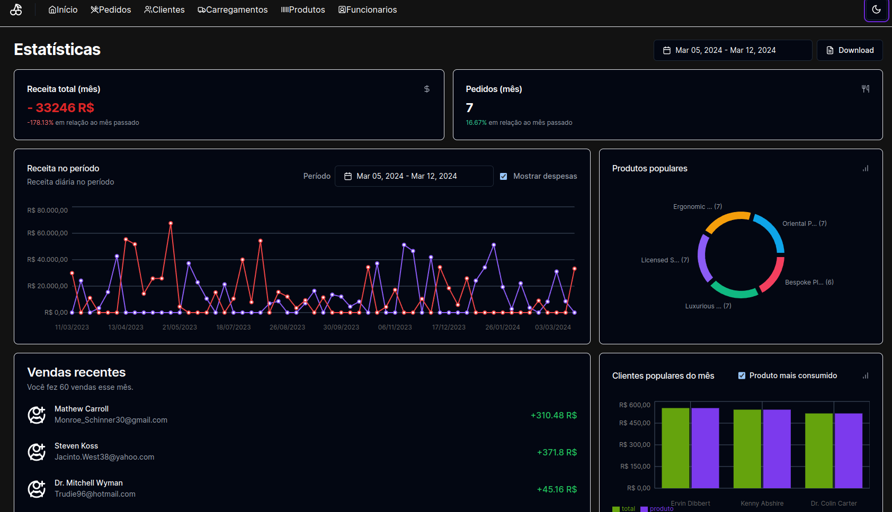

# CODERS - Açai




>Software backoffice de gestão de um negócio de Açai, com controle de compras, vendas, estatísticas e relatórios.
### Ajustes e melhorias

O projeto ainda está em desenvolvimento e as próximas atualizações serão voltadas nas seguintes tarefas:

- [ ] Melhorar níveis de acesso da aplicação
- [ ] Melhorar cobertura de testes no backend
- [ ] Implementar gráficos nos relatórios
- [ ] Aba de perfil de Clientes

## 💻 Pré-requisitos

Antes de começar, verifique se você atendeu aos seguintes requisitos:

- Você instalou a versão mais recente de `<node / docker >`
- Você tem uma máquina `< Linux / Mac>`.
- 
## 🚀 Instalando <CODERS-Açai>

Para instalar o <CODERS-Açai>, siga estas etapas:

Linux e macOS:

```
npm install
```

E instalando docker e docker-compose no seu sistema(https://docs.docker.com/compose/)

## ☕ Usando <CODERS-Açai>

Para usar <CODERS-Açai>, siga estas etapas:

```
npm run services:up
npm run dev
```

Ao subir o banco pela primeira vez, rode as migrations:
```
npx prisma migrate dev
npm run seed
```
## 📫 Contribuindo para <CODERS-Açai>

Para contribuir com <CODERS-Açai>, siga estas etapas:

1. Fork este repositório.
2. Crie um branch: `git checkout -b <nome_branch>`.
3. Faça suas alterações e confirme-as: `git commit -m '<mensagem_commit>'`
4. Envie para o branch original: `git push origin <nome_do_projeto> / <local>`
5. Crie a solicitação de pull.

Como alternativa, consulte a documentação do GitHub em [como criar uma solicitação pull](https://help.github.com/en/github/collaborating-with-issues-and-pull-requests/creating-a-pull-request).


## 😄 Seja um dos contribuidores

Quer fazer parte desse projeto? Clique [AQUI](CONTRIBUTING.md) e leia como contribuir.

## 📝 Licença

Esse projeto está sob licença. Veja o arquivo [LICENÇA](LICENSE.md) para mais detalhes.
